Challenges (my random notes)

Author: Khaled Alam (khaledalam.net@gmail.com)
© 2020
_______________________

Primes:

on classical computer:

|Lower bound | Upper bound | Count primes | ~ Elapsed time | Threads | Sieve size | Options|
--- |--- |--- |--- |--- |--- |---
|0 | 1               | 4             | 0.0 sec       | 1  | 4096 KiB | printing|
|0 | 100             | 25            | 0.0 sec       | 1  | 4096 KiB | printing|
|0 | 1000            | 168           | 0.0 sec       | 1  | 4096 KiB | printing|
|0 | 10000           | 1229          | 0.0 sec       | 1  | 4096 KiB | printing|
|0 | 100000          | 9592          | 0.0 sec       | 1  | 4096 KiB | printing|
|0 | 1000000         | 78498         | 1.46 sec      | 1  | 4096 KiB | printing|
|0 | 10000000        | 664579        | 11.92 sec     | 1  | 4096 KiB | printing|
|0 | 100000000       | 5761455       | 124.70 sec    | 1  | 4096 KiB | printing|
|0 | 100000000       | 5761455       | 0.0 sec       | 8  | 4096 KiB | -|
|0 | 1000000000      | 50847534      | 0.0 sec       | 12 | 4096 KiB | -|
|0 | 10000000000     | 455052511     | 3.06 sec      | 12 | 4096 KiB | -|
|0 | 100000000000    | 4118054813    | 48.99 sec     | 12 | 4096 KiB | -|
|0 | 1000000000000   | 37607912018   | - sec     | 12 | 4096 KiB | -|

sequence: https://oeis.org/A006880

  
Figures:

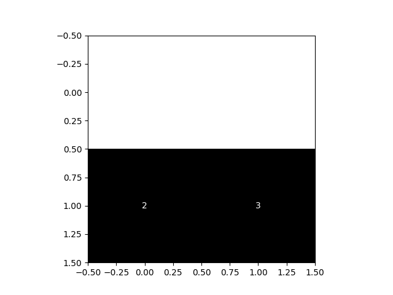
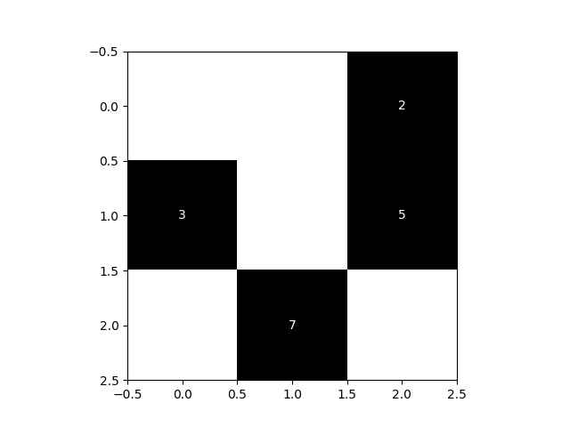
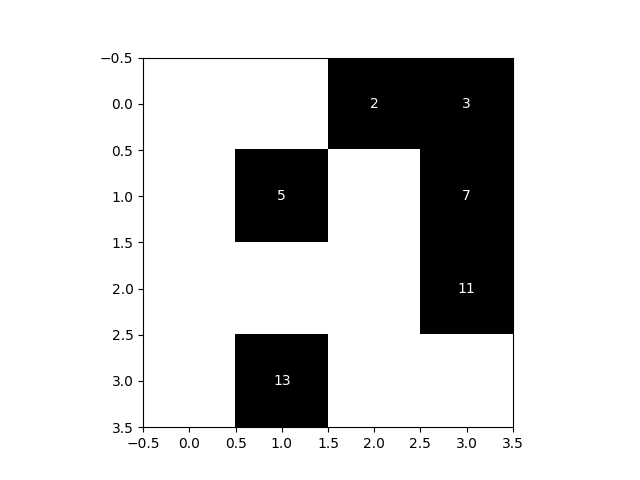

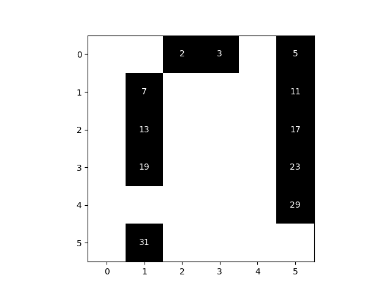
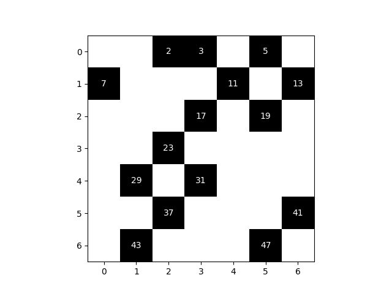
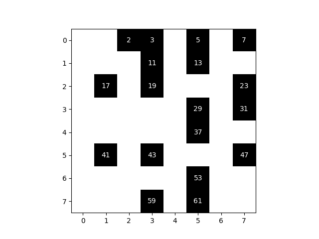
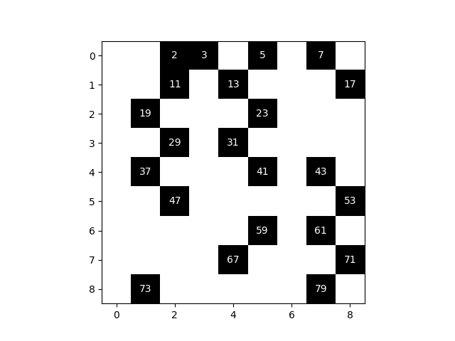
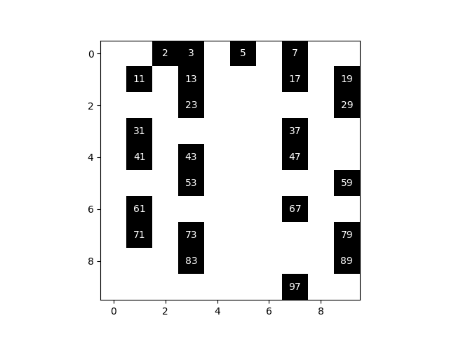
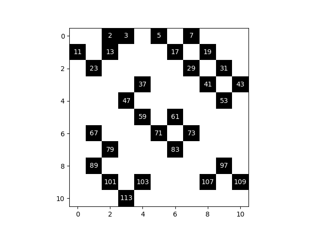
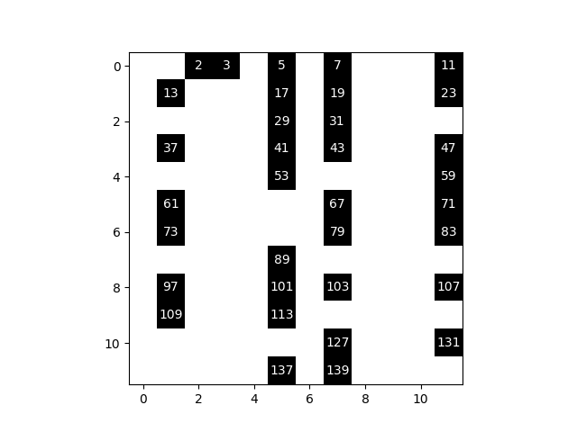
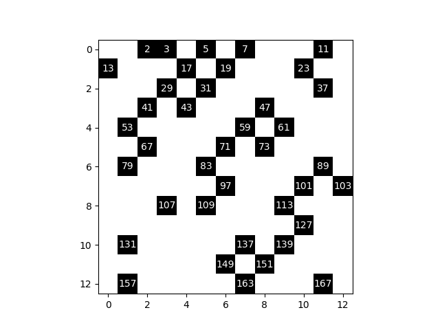
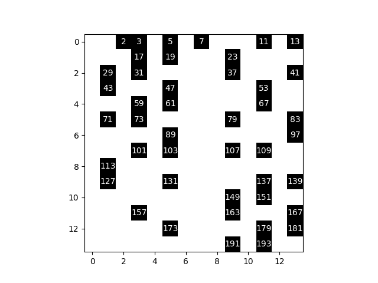
-----

- Quantum computing
- Primes
- RSA Cryptosystem
- Shor's Algorithm
- Ulam spiral
- Secure Hash Algorithms: SHA-2, SHA-256, SHA-512
- GNFS
- Quantum Fourier transform
- Knapsack

------

Quantum computer:

* Break 2048-bit RSA encryption in 8 hours

------
