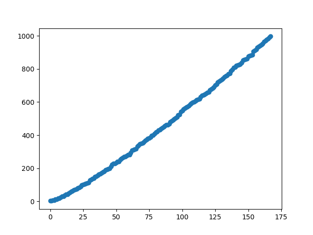

Challenges (my random notes)

Author: Khaled Alam (khaledalam.net@gmail.com)
© 2020
_______________________


Primes:

on classical computer:

|Lower bound | Upper bound | Count primes | ~ Elapsed time | Threads | Sieve size | Options|
--- |--- |--- |--- |--- |--- |---
|0 | 1               | 4             | 0.0 sec       | 1  | 4096 KiB | printing|
|0 | 100             | 25            | 0.0 sec       | 1  | 4096 KiB | printing|
|0 | 1000            | 168           | 0.0 sec       | 1  | 4096 KiB | printing|
|0 | 10000           | 1229          | 0.0 sec       | 1  | 4096 KiB | printing|
|0 | 100000          | 9592          | 0.0 sec       | 1  | 4096 KiB | printing|
|0 | 1000000         | 78498         | 1.46 sec      | 1  | 4096 KiB | printing|
|0 | 10000000        | 664579        | 11.92 sec     | 1  | 4096 KiB | printing|
|0 | 100000000       | 5761455       | 124.70 sec    | 1  | 4096 KiB | printing|
|0 | 100000000       | 5761455       | 0.0 sec       | 8  | 4096 KiB | -|
|0 | 1000000000      | 50847534      | 0.0 sec       | 12 | 4096 KiB | -|
|0 | 10000000000     | 455052511     | 3.06 sec      | 12 | 4096 KiB | -|
|0 | 100000000000    | 4118054813    | 48.99 sec     | 12 | 4096 KiB | -|
|0 | 1000000000000   | 37607912018   | - sec     | 12 | 4096 KiB | -|

sequence: https://oeis.org/A006880


## Primes Figures:

NxN:<br>


<hr>

2-1000 and 2-10000:<br>



## Full => <a href="primes_figures.md">primes_figures.md</a>

-----
PI:

PI Benchmark Multi-Threaded:  (RAM)<br>


-----
### Mersenne Primes:

```Author: Khaled Alam(khaledalam.net@gmail.com)

Mersenne Primes:
(2^P)-1 |     value      | time
-----------------------------------------
(2 ^  2)-1 =       3 | Elasped time is 0.00 seconds.
(2 ^  3)-1 =       7 | Elasped time is 0.00 seconds.
(2 ^  5)-1 =      31 | Elasped time is 0.00 seconds.
(2 ^  7)-1 =     127 | Elasped time is 0.00 seconds.
(2 ^ 13)-1 =    8191 | Elasped time is 0.05 seconds.
(2 ^ 17)-1 =  131071 | Elasped time is 1.10 seconds.
(2 ^ 19)-1 =  524287 | Elasped time is 5.79 seconds.
...
```


### Code: 
<details><summary>Mersenne Primes C++ Code using BigInteger</summary><p>

```c++
/**
 *    Author: Khaled Alam (ninjo)
 *    Email : khaledalam.net@gmail.com
 **/
#include <bits/stdc++.h>
#include "BigNumberCPP/bignumber.h"

using namespace std;


/*
Output sample:

Author: Khaled Alam(khaledalam.net@gmail.com)

Mersenne Primes:
(2^P)-1 |     value      | time
-----------------------------------------
(2 ^  2)-1 =       3 | Elasped time is 0.00 seconds.
(2 ^  3)-1 =       7 | Elasped time is 0.00 seconds.
(2 ^  5)-1 =      31 | Elasped time is 0.00 seconds.
(2 ^  7)-1 =     127 | Elasped time is 0.00 seconds.
(2 ^ 13)-1 =    8191 | Elasped time is 0.05 seconds.
(2 ^ 17)-1 =  131071 | Elasped time is 1.19 seconds.
(2 ^ 19)-1 =  524287 | Elasped time is 6.08 seconds.
...

*/


map<BigNumber, bool> vis;
map<BigNumber, bool> mem;

bool isPrime(BigNumber &N) {

	if (vis[N])
		return mem[N];

	if (N <= BigNumber(1)) {
		vis[N] = true;
		return mem[N] = false;
	}

	if (N <= BigNumber(3)) {
		vis[N] = true;
		return mem[N] = true;
	}

	BigNumber divBy2 = N / BigNumber(2);
	BigNumber divBy3 = N / BigNumber(3);

	if ((divBy2 * BigNumber(2)) == N || (divBy3 * BigNumber(3)) == N) {
		vis[N] = true;
		return mem[N] = false;
	}

	BigNumber itr(5);

	while (itr * itr <= N) {

		BigNumber divByI = N / itr;
		BigNumber divByIPlus2 = N / (itr + BigNumber(2));

		if (divByI * itr == N || divByIPlus2 * (itr + BigNumber(2)) == N) {
			vis[N] = true;
			return mem[N] = false;
		}

		itr += BigNumber(6);
	}

	vis[N] = true;
	return mem[N] = true;

}

int main() {
	ios::sync_with_stdio(false);
	cin.tie(0);
	cout.tie(0);
//	freopen("input.txt", "r", stdin); //freopen("output.txt", "w", stdout);

	BigNumber base(2);

	int exp = 1;
	printf("Author: Khaled Alam(khaledalam.net@gmail.com)\n\nMersenne Primes:\n(2^P)-1 |%4s value %4s | time\n-----------------------------------------\n", "", "");

	const int MX = 100;

	while (exp++ <= MX) {
		BigNumber F(base.pow(exp) - BigNumber(1));

		clock_t begin = clock();

		bool result = isPrime(F);

		clock_t end = clock();
		double elapsed_secs = double(end - begin) / CLOCKS_PER_SEC;

		if (result) {
			printf("(2 ^%3d)-1 = %7s | Elasped time is %.2lf seconds.\n",
					exp, F.getString().c_str(), elapsed_secs);
		}
	}

}

```
</p></details>


-----

- Quantum computing
- Primes
- RSA Cryptosystem
- Shor's Algorithm
- Ulam spiral
- Secure Hash Algorithms: SHA-2, SHA-256, SHA-512
- GNFS
- Quantum Fourier transform
- Knapsack
- Compress the 1GB file enwik9 to less than the current record of about 116MB
- PI
- Mersenne Primes


------

Quantum computer:

* Break 2048-bit RSA encryption in 8 hours


------
