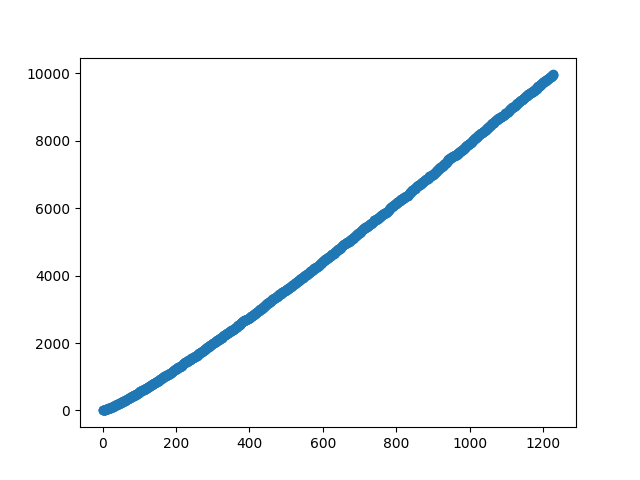
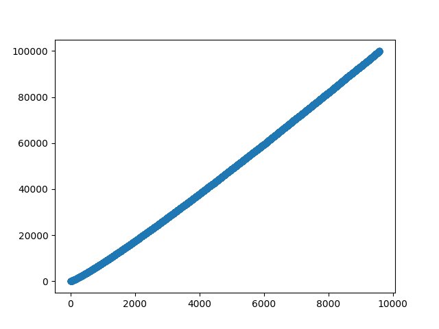

Challenges (my random notes)

Author: Khaled Alam (khaledalam.net@gmail.com)
© 2020
_______________________

- Quantum computing
- Primes
- RSA cryptosystem
- Shor's algorithm
- Ulam spiral
- Secure Hash algorithms: SHA-2, SHA-256, SHA-512
- Bernstein–Vazirani algorithm
- GNFS
- Quantum Fourier transform
- Knapsack
- Compress the 1GB file enwik9 to less than the current record of about 116MB
- PI
- Mersenne primes
- Miller-Rabin algortihm


-----

## Quantum Computing:

* Break 2048-bit RSA encryption in 8 hours

* Guess binary string (secret) of length N in 1 shot only using quantum circuit!

```
~ by using clasical computers we need at least N shots to guess binary string (secret) of length N
~ by using quantum computer we need 1 shot to guess binary string (secret) of ANY length
```

### Code: 
<details><summary>designing quantum circuit</summary><p>

```python
# Author: Khaled Alam(khaledalam.net@gmail.com)

'''
    Guess binary string (secret) of length N in 1 shot only using quantum computing circuit!

    ~ by using clasical computers we need at least N shots to guess string (secret) of length N

    ~ by using quantum computer we need 1 shot to guess string (secret) of ANY length ( cool isn't it! ^^ )

'''


secret = '01000001' # `01000001` = `A`

from qiskit import *

n = len(secret) 

qCircuit = QuantumCircuit(n+1, n) # n+1 qubits and n classical bits

qCircuit.x(n)

qCircuit.barrier()

qCircuit.h(range(n+1))

qCircuit.barrier() 

for ii, OZ in enumerate(reversed(secret)):
    if OZ == '1': 
        qCircuit.cx(ii, n)
    
qCircuit.barrier()


qCircuit.h(range(n+1))

qCircuit.barrier()

qCircuit.measure(range(n), range(n))

%matplotlib inline
qCircuit.draw(output='mpl')

```
</p></details>


Quantum circuit of (`A` <=> `01000001`)<br>

<br>

<details><summary>run on simulator</summary><p>

```python
# run on simulator
simulator = Aer.get_backend('qasm_simulator')
result = execute(qCircuit, backend=simulator, shots=1).result() # only 1 shot
from qiskit.visualization import plot_histogram
plot_histogram(
    result.get_counts(qCircuit)
)
```
</p></details>


<br><br>

<hr>

## Math notes:

### Bases and Exponents

If:  A ^ B = C<br>
Then: B = log(C) / log(A)

```python
c = 1024
a = 2
b = int((math.log(c, 10) / math.log(a, 10)))
if(a**b == c):
   print(str(a) + "^" + str(b) + " = " + str(c))
   # output: 2^10 = 1024
```


If A ^ B = C<br>
Then: (A ^ X) * (A ^ Y) = C where (X + Y) = B


```python
print(2**10) # output:  1024
print(2**7 * 2**3) # output: 1024  (7+3 = 10)
```


<br><br>

<hr>

## Primes:

on classical computer:

|Lower bound | Upper bound | Count primes | ~ Elapsed time | Threads | Sieve size | Options|
--- |--- |--- |--- |--- |--- |---
|0 | 1               | 4             | 0.0 sec       | 1  | 4096 KiB | printing|
|0 | 100             | 25            | 0.0 sec       | 1  | 4096 KiB | printing|
|0 | 1000            | 168           | 0.0 sec       | 1  | 4096 KiB | printing|
|0 | 10000           | 1229          | 0.0 sec       | 1  | 4096 KiB | printing|
|0 | 100000          | 9592          | 0.0 sec       | 1  | 4096 KiB | printing|
|0 | 1000000         | 78498         | 1.46 sec      | 1  | 4096 KiB | printing|
|0 | 10000000        | 664579        | 11.92 sec     | 1  | 4096 KiB | printing|
|0 | 100000000       | 5761455       | 124.70 sec    | 1  | 4096 KiB | printing|
|0 | 100000000       | 5761455       | 0.0 sec       | 8  | 4096 KiB | -|
|0 | 1000000000      | 50847534      | 0.0 sec       | 12 | 4096 KiB | -|
|0 | 10000000000     | 455052511     | 3.06 sec      | 12 | 4096 KiB | -|
|0 | 100000000000    | 4118054813    | 48.99 sec     | 12 | 4096 KiB | -|
|0 | 1000000000000   | 37607912018   | - sec     | 12 | 4096 KiB | -|

sequence: https://oeis.org/A006880


<br><br>

### pows ast digits that repeat in cycle:

|Number  |  Last digits that repeat in cycle|
--- |---
|  1     |  1|
|  2     |  4, 8, 6, 2|
|  3     |  9, 7, 1, 3|
|  4     |  6, 4|
|  5     |  5|
|  6     |  6|
|  7     |  9, 3, 1, 7|
|  8     |  4, 2, 6, 8|
|  9     |  1, 9|


|base number|	2nd power |	3rd |	4th |	5th | 6th | 7th | 8th | 9th  | 10th |
---|---|---|---|---|---|---|---|---|---
| 2	|4	|8	|16	|32	|64	|128	|256	|512	|1024	|
| 3	|9	|27	|81	|243	|729	|2187	|6561	|19683	|59049	|
| 4	|16	|64	|256	|1024	|4096	|16384	|65536	|262144	|1048576	|
| 5	|25	|125	|625	|3125	|15625	|78125	|390625	|1953125	|9765625	|
| 6	|36	|216	|1296	|7776	|46656	|279936	|1679616	|10077696	|60466176	|
| 7	|49	|343	|2401	|16807	|117649	|823543	|5764801	|40353607	|282475249	|
| 8	|64	|512	|4096	|32768	|262144	|2097152	|16777216	|134217728	|1073741824	|
| 9	|81	|729	|6561	|59049	|531441	|4782969	|43046721	|387420489	|3486784401	|
| 10	|100	|1000	|10000	|100000	|1000000	|10000000	|100000000	|1000000000	|10000000000	|
| 11	|121	|1331	|14641	|161051	|1771561	|19487171	|214358881	|2357947691	|25937424601	|
| 12	|144	|1728	|20736	|248832	|2985984	|35831808	|429981696	|5159780352	|61917364224	|
| 13	|169	|2197	|28561	|371293	|4826809	|62748517	|815730721	|10604499373	|137858491849	|
| 14	|196	|2744	|38416	|537824	|7529536	|105413504	|1475789056	|20661046784	|289254654976	|
| 15	|225	|3375	|50625	|759375	|11390625	|170859375	|2562890625	|38443359375	|576650390625	|
| 16	|256	|4096	|65536	|1048576	|16777216	|268435456	|4294967296	|68719476736	|1099511627776	|
| 17	|289	|4913	|83521	|1419857	|24137569	|410338673	|6975757441	|118587876497	|2015993900449	|
| 18	|324	|5832	|104976	|1889568	|34012224	|612220032	|11019960576	|198359290368	|3570467226624	|
| 19	|361	|6859	|130321	|2476099	|47045881	|893871739	|16983563041	|322687697779	|6131066257801	|
| 20	|400	|8000	|160000	|3200000	|64000000	|1280000000	|25600000000	|512000000000	|10240000000000	|

more: <a href="powers.md">powers.md</a>


<br><br><br>

## Primes Figures:

6x6, 7x7, 8x8, ...:<br>


<hr>

2-1000, 2-10000, 2-100000:<br>




more: <a href="primes_figures.md">primes_figures.md</a>
<br><br>

-----
## Mersenne Primes:

```Author: Khaled Alam(khaledalam.net@gmail.com)

Mersenne Primes:
(2^P)-1 |     value      | time
-----------------------------------------
(2 ^  2)-1 =       3 | Elasped time is 0.00 seconds.
(2 ^  3)-1 =       7 | Elasped time is 0.00 seconds.
(2 ^  5)-1 =      31 | Elasped time is 0.00 seconds.
(2 ^  7)-1 =     127 | Elasped time is 0.00 seconds.
(2 ^ 13)-1 =    8191 | Elasped time is 0.05 seconds.
(2 ^ 17)-1 =  131071 | Elasped time is 1.10 seconds.
(2 ^ 19)-1 =  524287 | Elasped time is 5.79 seconds.
...
```

### Code: 
<details><summary>Mersenne Primes C++ Code using BigInteger</summary><p>

```c++
/**
 *    Author: Khaled Alam (ninjo)
 *    Email : khaledalam.net@gmail.com
 **/
#include <bits/stdc++.h>
#include "BigNumberCPP/bignumber.h"

using namespace std;

map<BigNumber, bool> vis;
map<BigNumber, bool> mem;

bool isPrime(BigNumber &N) {

	if (vis[N])
		return mem[N];

	if (N <= BigNumber(1)) {
		vis[N] = true;
		return mem[N] = false;
	}


	if (N <= BigNumber(3)) {
		vis[N] = true;
		return mem[N] = true;
	}

	BigNumber divBy2 = N / BigNumber(2);
	BigNumber divBy3 = N / BigNumber(3);

	if ((divBy2 * BigNumber(2)) == N || (divBy3 * BigNumber(3)) == N) {
		vis[N] = true;
		return mem[N] = false;
	}

	BigNumber itr(5);

	while (itr * itr <= N) {

		BigNumber divByI = N / itr;
		BigNumber divByIPlus2 = N / (itr + BigNumber(2));

		if (divByI * itr == N || divByIPlus2 * (itr + BigNumber(2)) == N) {
			vis[N] = true;
			return mem[N] = false;
		}

		itr += BigNumber(6);
	}

	vis[N] = true;
	return mem[N] = true;

}

int main() {
	ios::sync_with_stdio(false);
	cin.tie(0);
	cout.tie(0);
//	freopen("input.txt", "r", stdin); //freopen("output.txt", "w", stdout);

	BigNumber base(2);

	int exp = 1;
	printf("Author: Khaled Alam(khaledalam.net@gmail.com)\n\nMersenne Primes:\n(2^P)-1 |%4s value %4s | time\n-----------------------------------------\n", "", "");

	const int MX = 100;

	while (exp++ <= MX) {
		BigNumber F(base.pow(exp) - BigNumber(1));

		clock_t begin = clock();

		bool result = isPrime(F);

		clock_t end = clock();
		double elapsed_secs = double(end - begin) / CLOCKS_PER_SEC;

		if (result) {
			printf("(2 ^%3d)-1 = %7s | Elasped time is %.2lf seconds.\n",
					exp, F.getString().c_str(), elapsed_secs);
		}
	}

}

```
</p></details>


<br><br>

### Advanced:

(Probabilistic tests, Miller-Rabin, Fermat primality test, Carmichael numbers, ...)

output:
```
time: 0:00:00.000002,   (2^2)-1,      digits length: 1
time: 0:00:00.000283,   (2^3)-1,      digits length: 1
time: 0:00:00.000274,   (2^5)-1,      digits length: 2
time: 0:00:00.000276,   (2^7)-1,      digits length: 3
time: 0:00:00.000449,   (2^13)-1,     digits length: 4
time: 0:00:00.000477,   (2^17)-1,     digits length: 6
time: 0:00:00.000536,   (2^19)-1,     digits length: 6
time: 0:00:00.001249,   (2^31)-1,     digits length: 10
time: 0:00:00.002967,   (2^61)-1,     digits length: 19
time: 0:00:00.004160,   (2^89)-1,     digits length: 27
time: 0:00:00.005148,   (2^107)-1,    digits length: 33
time: 0:00:00.006455,   (2^127)-1,    digits length: 39
time: 0:00:00.072748,   (2^521)-1,    digits length: 157
time: 0:00:00.107656,   (2^607)-1,    digits length: 183
time: 0:00:01.026329,   (2^1279)-1,   digits length: 386
time: 0:00:03.711185,   (2^2203)-1,   digits length: 664
time: 0:00:03.835759,   (2^2281)-1,   digits length: 687
time: 0:00:10.750292,   (2^3217)-1,   digits length: 969
time: 0:00:22.843608,   (2^4253)-1,   digits length: 1281
time: 0:00:25.689716,   (2^4423)-1,   digits length: 1332
...
```


-----
## PI:

PI Benchmark Multi-Threaded:  (RAM)<br>


